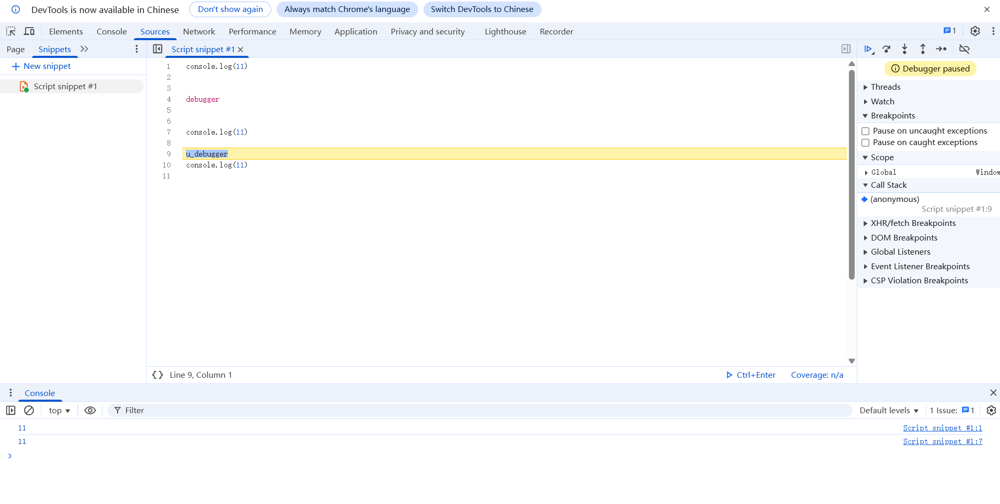
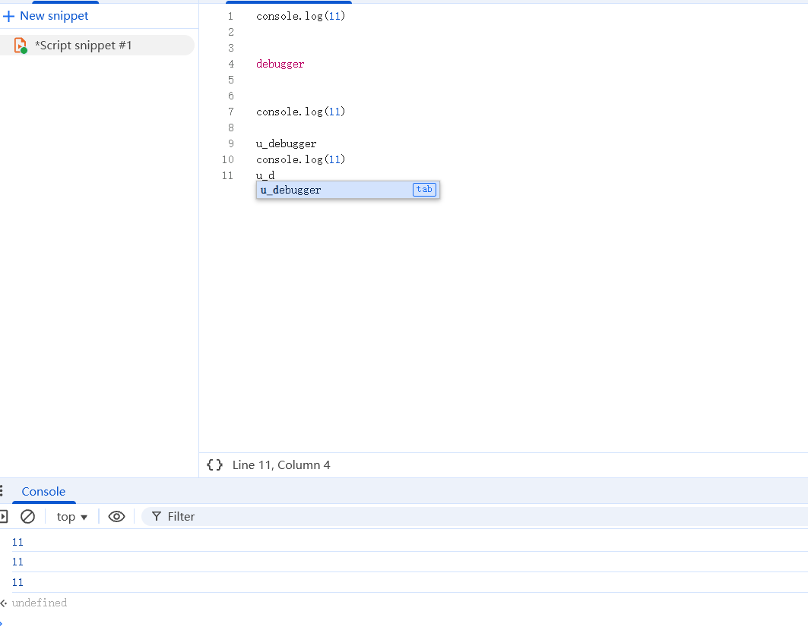

# 修改 debugger 关键字, 创建自己的 debugger 关键字

## 思路
将 debugger 关键字的 token 换成 null, 添加一个自己关键字

## 阅读一下 v8 前端代码, 扫描器实现的位置(可以从官方给出的示例中一点点跟 `v8/samples/hello-world.cc`)
因为不是阅读 v8 代码的文章, 不在介绍怎么从头跟了, 直接看  `v8/src/parsing/scanner-inl.h` 中的 `V8_INLINE Token::Value Scanner::ScanSingleToken` 函数, 解释器的第一步, 将扫描文本生成 token 找到识别关键字的代码
```cpp
case Token::kIdentifier:
  return ScanIdentifierOrKeyword();
```
向前跟两补到达 `V8_INLINE Token::Value Scanner::ScanIdentifierOrKeywordInner` 函数, 来看看这段代码:
```cpp
  if (!CanBeKeyword(scan_flags)) return Token::kIdentifier;
  // Could be a keyword or identifier.
  base::Vector<const uint8_t> chars =
      next().literal_chars.one_byte_literal();
  return KeywordOrIdentifierToken(chars.begin(), chars.length());
```
阻碍我们添加关键字的第一道门槛是 `CanBeKeyword(scan_flags)` 预判断, 关键字经过它后才能进入 `KeywordOrIdentifierToken` 函数做一个完全判断。让我们看看 `scan_flags` 是怎么生成的, 关键地方是这里:
```cpp
AdvanceUntil([this, &scan_flags](base::uc32 c0) {
  // 非 ASCII 字符触发慢速路径
  if (V8_UNLIKELY(static_cast<uint32_t>(c0) > kMaxAscii)) {
    // A non-ascii character means we need to drop through to the slow
    // path.
    // TODO(leszeks): This would be most efficient as a goto to the slow
    // path, check codegen and maybe use a bool instead.
    scan_flags |=
        static_cast<uint8_t>(ScanFlags::kIdentifierNeedsSlowPath);
    return true;
  }
  uint8_t char_flags = character_scan_flags[c0];
  scan_flags |= char_flags; // 累积字符标志位

  // 遇到终止符（如引号、换行符）时停止扫描
  if (TerminatesLiteral(char_flags)) {
    return true;
  } else {
    AddLiteralChar(static_cast<char>(c0)); // 记录合法字符
    return false; // 继续扫描
  }
});
```
v8 在辨别是关键字还是变量的预判断中做了一个映射表, 即判断哪些标识符可能是关键字, 哪些标识符一看就不可能, 直接筛去一部分, 以提高运行效率。以 flags 的形式记录, 让我们看看 `character_scan_flags` 是怎么生成的:
```cpp
// Table of precomputed scan flags for the 128 ASCII characters, for branchless
// flag calculation during the scan.
static constexpr const uint8_t character_scan_flags[128] = {
#define CALL_GET_SCAN_FLAGS(N) GetScanFlags(N),
    INT_0_TO_127_LIST(CALL_GET_SCAN_FLAGS)
#undef CALL_GET_SCAN_FLAGS
};

constexpr uint8_t GetScanFlags(char c) {
  return
      // Keywords are all lowercase and only contain letters.
      // Note that non-identifier characters do not set this flag, so
      // that it plays well with kTerminatesLiteral.
      (IsAsciiIdentifier(c) && !CanBeKeywordCharacter(c)
           ? static_cast<uint8_t>(ScanFlags::kCannotBeKeyword)
           : 0) |
      (IsKeywordStart(c)
           ? 0
           : static_cast<uint8_t>(ScanFlags::kCannotBeKeywordStart)) |
      // Anything that isn't an identifier character will terminate the
      // literal, or at least terminates the literal fast path processing
      // (like an escape).
      (!IsAsciiIdentifier(c)
           ? static_cast<uint8_t>(ScanFlags::kTerminatesLiteral)
           : 0) |
      // Possible string termination characters.
      ((c == '\'' || c == '"' || c == '\n' || c == '\r' || c == '\\')
           ? static_cast<uint8_t>(ScanFlags::kStringTerminator)
           : 0) |
      // Escapes are processed on the slow path.
      (c == '\\' ? static_cast<uint8_t>(ScanFlags::kIdentifierNeedsSlowPath)
                 : 0) |
      // Newlines and * are interesting characters for multiline comment
      // scanning.
      (c == '\n' || c == '\r' || c == '*'
           ? static_cast<uint8_t>(
                 ScanFlags::kMultilineCommentCharacterNeedsSlowPath)
           : 0);
}

// clang-format off
#define INT_0_TO_127_LIST(V)                                          \
V(0)   V(1)   V(2)   V(3)   V(4)   V(5)   V(6)   V(7)   V(8)   V(9)   \
V(10)  V(11)  V(12)  V(13)  V(14)  V(15)  V(16)  V(17)  V(18)  V(19)  \
V(20)  V(21)  V(22)  V(23)  V(24)  V(25)  V(26)  V(27)  V(28)  V(29)  \
V(30)  V(31)  V(32)  V(33)  V(34)  V(35)  V(36)  V(37)  V(38)  V(39)  \
V(40)  V(41)  V(42)  V(43)  V(44)  V(45)  V(46)  V(47)  V(48)  V(49)  \
V(50)  V(51)  V(52)  V(53)  V(54)  V(55)  V(56)  V(57)  V(58)  V(59)  \
V(60)  V(61)  V(62)  V(63)  V(64)  V(65)  V(66)  V(67)  V(68)  V(69)  \
V(70)  V(71)  V(72)  V(73)  V(74)  V(75)  V(76)  V(77)  V(78)  V(79)  \
V(80)  V(81)  V(82)  V(83)  V(84)  V(85)  V(86)  V(87)  V(88)  V(89)  \
V(90)  V(91)  V(92)  V(93)  V(94)  V(95)  V(96)  V(97)  V(98)  V(99)  \
V(100) V(101) V(102) V(103) V(104) V(105) V(106) V(107) V(108) V(109) \
V(110) V(111) V(112) V(113) V(114) V(115) V(116) V(117) V(118) V(119) \
V(120) V(121) V(122) V(123) V(124) V(125) V(126) V(127)
// clang-format on
```
总结来说就是将 0-127 输入 `GetScanFlags` 函数, 然后与结果做一个映射, 用 py 实现就是:
```py
character_scan_flags = []
for i in range(0, 127):
    character_scan_flags.append(GetScanFlags(i))
```
因为 char 实际上是一个 0-127 直接的数字, 所以可以直接使用。接下来重点放在 `CanBeKeywordCharacter` `IsKeywordStart` 函数, 先来看 `CanBeKeywordCharacter`:
```cpp
// Recursive constexpr template magic to check if a character is in a given
// string.
template <int N>
constexpr bool IsInString(const char (&s)[N], char c, size_t i = 0) {
  return i >= N ? false : s[i] == c ? true : IsInString(s, c, i + 1);
}

inline constexpr bool CanBeKeywordCharacter(char c) {
  return IsInString(
#define KEYWORD_GROUP_CASE(ch)  // Nothing
#define KEYWORD(keyword, token) keyword
      // Use C string literal concatenation ("a" "b" becomes "ab") to build one
      // giant string containing all the keywords.
      KEYWORDS(KEYWORD_GROUP_CASE, KEYWORD)
#undef KEYWORD
#undef KEYWORD_GROUP_CASE
          ,
      c);
}

// Keyword Matcher
#define KEYWORDS(KEYWORD_GROUP, KEYWORD)                  \
  KEYWORD_GROUP('a')                                      \
  KEYWORD("async", Token::kAsync)                         \
  KEYWORD("await", Token::kAwait)                         \
  KEYWORD_GROUP('b')                                      \
  KEYWORD("break", Token::kBreak)                         \
  KEYWORD_GROUP('c')                                      \
  KEYWORD("case", Token::kCase)                           \
  KEYWORD("catch", Token::kCatch)                         \
  KEYWORD("class", Token::kClass)                         \
  KEYWORD("const", Token::kConst)                         \
  KEYWORD("continue", Token::kContinue)                   \
  KEYWORD_GROUP('d')                                      \
  KEYWORD("debugger", Token::kDebugger)                   \
  KEYWORD("default", Token::kDefault)                     \
  KEYWORD("delete", Token::kDelete)                       \
  KEYWORD("do", Token::kDo)                               \
  KEYWORD_GROUP('e')                                      \
  KEYWORD("else", Token::kElse)                           \
  // ... 太多了没列全
```
利用了​​递归模板元编程以及宏一些​的骚操作, 总的来说就是将所用的关键字全拼接起来形成一个长字符串, 像这样 "asyncawaitbreakcase..." 然后如果要检查的字符在这堆字符串中就返回 true, 如果遍历完了这段字符串也没找到就返回 false,

然后是 `IsKeywordStart`
```cpp
constexpr bool IsKeywordStart(char c) {
#define KEYWORD_GROUP_CHECK(ch) c == ch ||
#define KEYWORD_CHECK(keyword, token)
  return KEYWORDS(KEYWORD_GROUP_CHECK, KEYWORD_CHECK) /* || */ false;
#undef KEYWORD_GROUP_CHECK
#undef KEYWORD_CHECK
}
```
简单来说就是检查开头, 如果首字符对不上就是 false, 对上了就认为可能是关键字。

好了, 现在我们可以通过 `KeywordOrIdentifierToken` 函数跟入 `v8/src/parsing/keywords-gen.h` 中的 `PerfectKeywordHash::GetToken` 函数了:
```cpp
inline Token::Value PerfectKeywordHash::GetToken(const char* str, int len) {
  if (base::IsInRange(len, MIN_WORD_LENGTH, MAX_WORD_LENGTH)) {
    unsigned int key = Hash(str, len) & 0x7f;

    DCHECK_LT(key, arraysize(kPerfectKeywordLengthTable));
    DCHECK_LT(key, arraysize(kPerfectKeywordHashTable));

    // 检查当前 key 对应的关键词长度是否与输入字符串的长度一致
    if (len == kPerfectKeywordLengthTable[key]) {
      // 获取当前 key 对应的关键词名称
      const char* s = kPerfectKeywordHashTable[key].name;

      // 遍历关键词名称，逐字符与输入字符串进行比较
      while (*s != 0) {
        if (*s++ != *str++) return Token::kIdentifier;
      }
      return kPerfectKeywordHashTable[key].value;
    }
  }
  return Token::kIdentifier;
}

inline unsigned int PerfectKeywordHash::Hash(const char* str, int len) {
  DCHECK_LT(str[1] + 1, 129);
  DCHECK_LT(str[0], 129);
  static const unsigned char asso_values[129] = {
      65, 65, 65, 65, 65, 65, 65, 65, 65, 65, 65, 65, 65, 65, 65, 65, 65,
      65, 65, 65, 65, 65, 65, 65, 65, 65, 65, 65, 65, 65, 65, 65, 65, 65,
      65, 65, 65, 65, 65, 65, 65, 65, 65, 65, 65, 65, 65, 65, 65, 65, 65,
      65, 65, 65, 65, 65, 65, 65, 65, 65, 65, 65, 65, 65, 65, 65, 65, 65,
      65, 65, 65, 65, 65, 65, 65, 65, 65, 65, 65, 65, 65, 65, 65, 65, 65,
      65, 65, 65, 65, 65, 65, 65, 65, 65, 65, 65, 65, 33, 0,  24, 18, 17,
      0,  31, 65, 15, 33, 65, 0,  25, 24, 14, 1,  65, 0,  10, 3,  36, 4,
      23, 26, 13, 1,  65, 65, 65, 65, 65, 65};
  return len + asso_values[static_cast<unsigned char>(str[1] + 1)] +
         asso_values[static_cast<unsigned char>(str[0])];
}
```
这是最小完美哈希的实现, 通过精心构造的哈希函数,确保​​所有关键字​​的哈希值在 [0, 127] 范围内​​互不冲突​​。每个关键字映射到唯一的桶(key), 有现成的算法可以生成完美哈希。

我们用 py 简单模拟一下:
```py
def Hash(s: str) -> int:
    """
    实现完美哈希函数
    :param s: 输入字符串
    :return: 哈希值
    """
    # 预定义的映射表
    asso_values = [
        65, 65, 65, 65, 65, 65, 65, 65, 65, 65, 65, 65, 65, 65, 65, 65, 65,
        65, 65, 65, 65, 65, 65, 65, 65, 65, 65, 65, 65, 65, 65, 65, 65, 65,
        65, 65, 65, 65, 65, 65, 65, 65, 65, 65, 65, 65, 65, 65, 65, 65, 65,
        65, 65, 65, 65, 65, 65, 65, 65, 65, 65, 65, 65, 65, 65, 65, 65, 65,
        65, 65, 65, 65, 65, 65, 65, 65, 65, 65, 65, 65, 65, 65, 65, 65, 65,
        65, 65, 65, 65, 65, 65, 65, 65, 65, 65, 65, 65, 33, 0,  24, 18, 17,
        0,  31, 65, 15, 33, 65, 0,  25, 24, 14, 1,  65, 0,  10, 3,  36, 4,
        23, 26, 13, 1,  65, 65, 65, 65, 65, 65
    ]
    
    # 检查输入有效性（模拟C++的DCHECK）
    if len(s) < 2:
        raise ValueError("输入字符串长度至少为2个字符")
    
    char0 = ord(s[0])
    char1 = ord(s[1]) + 1
    
    if char0 >= 129:
        raise ValueError(f"第一个字符ASCII值({char0})必须小于129")
    if char1 >= 129:
        raise ValueError(f"第二个字符ASCII值+1({char1})必须小于129")
    
    # 计算哈希值
    return len(s) + asso_values[char1] + asso_values[char0]

# 测试示例
if __name__ == "__main__":
    test_str = "debuggel"
    hash_val = Hash(test_str)
    print(f"字符串 '{test_str}' 的哈希值: {hash_val}")
```
这就是 v8 判断关键字的全部流程。

## 开始魔改(只想快速魔改的小伙伴可以直接看这, 前面算是方法论)
让我们从 `v8/src/parsing/keywords-gen.h` 开始。事实上官方提供了生成脚本 `v8/tools/gen-keywords-gen-h.py` 配合 `v8/src/parsing/keywords.txt`, 可以生成对应的 `v8/src/parsing/keywords-gen.h`,  因为我是在 windows 上开发的, 不太好使用 gperf 工具, 所以就不从自定义 keywords.txt 文件开始, 生成 keywords-gen.h 文件了

理想的情况是不改变 `PerfectKeywordHash::Hash` 函数中的 `asso_values`, 而是在 `kPerfectKeywordHashTable` 空闲的位置自定义一个关键字。好消息是有非常多的空闲位置, 如 u_debugger 对应的 hash 值为 111

### 将 kPerfectKeywordHashTable 中 debugger 关键字的 token 修改为 null 对应的 token
```cpp
{"debugger", Token::kNullLiteral},
```
### 将 kPerfectKeywordHashTable 中下标 111 处填入新的关键字

```cpp
{"u_debugger", Token::kDebugger},
```

### 将 kPerfectKeywordLengthTable 中下标 111 处长度值改为 u_debugger 的长度, 10
```cpp
static const unsigned char kPerfectKeywordLengthTable[128] = {
    0, 0, 0, 3, 3, 5,  6, 3, 7, 4, 6, 6, 8, 3, 0, 5, 3, 4,  7, 5, 9, 2,
    4, 5, 6, 7, 8, 3,  4, 5, 5, 2, 4, 8, 3, 4, 6, 7, 9, 10, 7, 5, 6, 5,
    5, 6, 4, 2, 2, 10, 0, 5, 6, 0, 5, 0, 0, 0, 0, 8, 4, 0,  0, 0, 5, 0,
    0, 0, 0, 0, 0, 0,  0, 0, 0, 0, 0, 0, 0, 0, 0, 0, 0, 0,  0, 0, 0, 0,
    0, 0, 0, 0, 0, 0,  0, 0, 0, 0, 0, 0, 0, 0, 0, 0, 0, 0,  0, 0, 0, 0,
    0, 10, 0, 0, 0, 0,  0, 0, 0, 0, 0, 0, 0, 0, 0, 0, 0, 0};
```
这样只是做好了第一步, 还要往回看, 关键字的预判断

### 修改关键字的预判断
来到 `v8/src/parsing/scanner-inl.h` 文件的 `#define KEYWORDS(KEYWORD_GROUP, KEYWORD)`, 增加:
```cpp
KEYWORD_GROUP('u')                                      \
KEYWORD("using", Token::kUsing)                         \
KEYWORD("u_debugger", Token::kDebugger)                 \
```
这里 `KEYWORD("debugger", Token::kDebugger)` 中的 `Token::kDebugger` 可以不用修改, 因为没用到

### 重新编译
```bash
autoninja -C out/Debug chrome
# autoninja -C out/Release chrome
```

### 试验一下
两个 debugger 对比

代码提示


将 patch 上传到附件了
```bash
git apply debugger.patch  # 应用工作区修改
```
